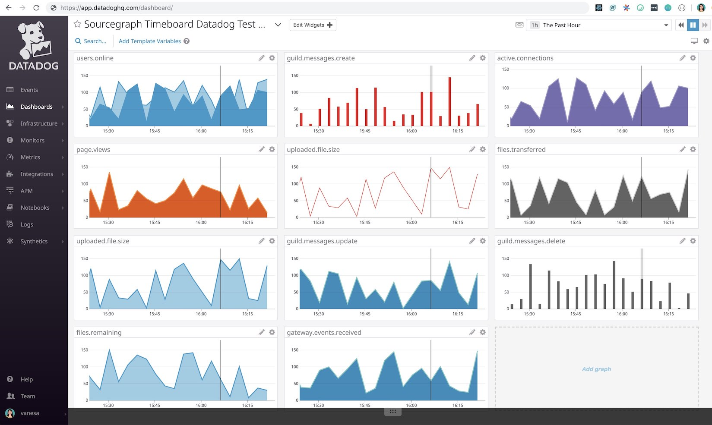

# Datadog Metrics Demo Code

This simple script will generate random Datadog metrics for common statsD commands to demo the [Sourcegraph Datadog Extension](https://github.com/sourcegraph/sourcegraph-datadog-metrics).


## Setup

1. Follow these instructions to setup Datadog's Dogshell to allow sending metrics from your terminal shell:
https://docs.datadoghq.com/developers/guide/dogshell-quickly-use-datadog-s-api-from-terminal-shell/

If you don't have a Datadog account yet, sign up on their [website](https://datadog.com).

2) Clone the repo:

    ```
    git clone git@github.com:sourcegraph/datadog-democode.git
    ```

3) Setup virtualenv:

    ```
    virtualenv --no-site-packages -p `which python3` venv
    source ./venv/bin/activate
    pip install -r requirements.txt
    ```

6) Run the script to start generating metrics:

    ```
    python gen_some_datadog_metrics.py
    ```

7) [Activate](https://sourcegraph.com/extensions/sourcegraph/datadog-metrics) the Datadog extension.

8) Open any [open source code](https://sourcegraph.com/github.com/sourcegraph/datadog-democode@master/-/blob/democode.py?diff=dcaaf3c8b0863a16f39c11aa69d27fd870654a34&utm_source=chrome-extension) that generates the following kind of incremental metrics:
    ```
    uploaded.file.size
    active.connections
    users.online 
    files.transferred
    page.views
    files.remaining
    guild.messages.create
    guild.messages.delete
    guild.messages.update
    gateway.events.received
    ```

Based on these metrics, you can setup your Datadog dashboard to look like this:
